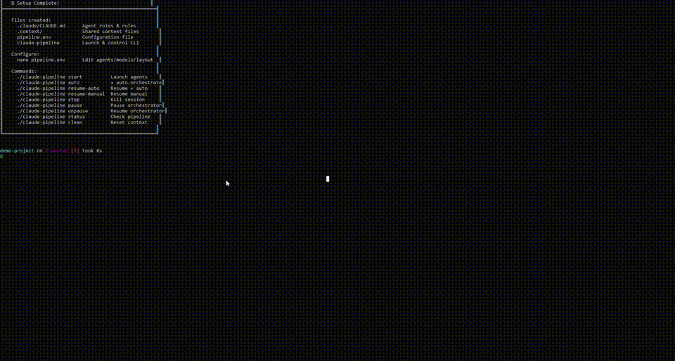

# 🤖 claude-agents — Drop-In Multi-Agent Pipeline for Claude Code

A portable toolkit that turns any project into a coordinated team of AI agents with a single command. No frameworks, no dependencies — just bash, tmux, and markdown.



## What It Does

Runs multiple Claude Code instances in tmux panes, each with a dedicated role. Agents communicate through shared markdown files using an append-only protocol. An auto-orchestrator watches pipeline state and triggers each agent automatically. A live control panel lets you monitor, skip steps, and intervene without breaking the flow.

## Agent Profiles

| Profile | Agents | Best For |
|---------|--------|----------|
| **2-agent** | Manager + Coder | Simple projects, saving costs |
| **3-agent** | Manager + Coder + Tester | Standard development (default) |
| **5-agent** | Manager + Coder + Tester + Security + Docs | Production-grade development |
| **6-agent** | Manager + Senior Dev + Junior Dev + Tester + Security + Docs | Team simulation |

Every role's model is configurable — use Opus for planning, Sonnet for coding, Haiku for testing, or any combination.

## Quick Start

### Install (one line)

```bash
git clone https://github.com/GrIlm14/claude-agents.git ~/claude-agents && chmod +x ~/claude-agents/setup.sh ~/claude-agents/scripts/pipeline.sh ~/claude-agents/scripts/control-panel.sh
```

### Set Up a Project

```bash
cd /path/to/any/project
~/claude-agents/setup.sh       # Creates config + role files
nano pipeline.env              # Optional: change agents/models/layout
./claude-pipeline doctor       # Preflight checks
./claude-pipeline auto         # Launch and go
```

That's it. Agent panes open up top, control panel at the bottom. Tell the Manager what to build. The orchestrator handles the rest.

## Prerequisites

- WSL2 (Ubuntu) on Windows, or native Linux/macOS
- tmux: `sudo apt install tmux`
- Node.js 18+: `curl -fsSL https://deb.nodesource.com/setup_20.x | sudo -E bash - && sudo apt install -y nodejs`
- Claude Code: `npm install -g @anthropic-ai/claude-code`
- Claude Pro/Max subscription or `ANTHROPIC_API_KEY`
- tmux base-index set to 0:
  ```bash
  echo "set -g base-index 0" >> ~/.tmux.conf
  echo "set -g pane-base-index 0" >> ~/.tmux.conf
  ```

## Commands

| Command | Description |
|---------|-------------|
| `./claude-pipeline auto` | Launch + orchestrator + control panel |
| `./claude-pipeline start` | Launch agents only (no orchestrator) |
| `./claude-pipeline resume-auto` | Restart with context catch-up + auto |
| `./claude-pipeline resume-manual` | Restart with context catch-up (manual) |
| `./claude-pipeline stop` | Kill everything |
| `./claude-pipeline pause` | Pause orchestrator (agents stay running) |
| `./claude-pipeline unpause` | Resume orchestrator |
| `./claude-pipeline status` | Show pipeline state, cycle count, context sizes |
| `./claude-pipeline logs` | Tail all context files live |
| `./claude-pipeline attach` | Reattach to tmux session |
| `./claude-pipeline clean` | Reset context files (keeps archive) |
| `./claude-pipeline nuke` | Full reset including archive |
| `./claude-pipeline doctor` | Run preflight checks |

### Flags

| Flag | Description |
|------|-------------|
| `--yolo` | Auto-accept all agent permissions (`--dangerously-skip-permissions`) |
| `--debug` | Verbose output for troubleshooting |

Example: `./claude-pipeline resume-auto --yolo --debug`

## Control Panel

The bottom tmux pane shows a live control panel with pipeline state and single-key commands:

```
╔═══════════════════════════════════════════════════════════════╗
║  🎛️  PIPELINE CONTROL PANEL                                  ║
╠═══════════════════════════════════════════════════════════════╣
║  Status: TEST_COMPLETE:PASS    Next: Security    Cycle: 3    ║
╠═══════════════════════════════════════════════════════════════╣
║  [1] Manager  [2] Coder  [3] Tester  [4] Security  [5] Docs ║
╠═══════════════════════════════════════════════════════════════╣
║  [s] Skip next   [m] Set status   [c] Custom prompt          ║
║  [p] Pause/Resume [r] Re-trigger  [l] View log               ║
╚═══════════════════════════════════════════════════════════════╝
```

| Key | Action |
|-----|--------|
| `1-6` | Trigger that agent directly |
| `s` | Skip the next agent in the chain |
| `m` | Set pipeline status manually |
| `c` | Send a custom prompt to any agent |
| `p` | Pause/resume the orchestrator |
| `r` | Re-trigger the current stuck agent |
| `l` | View orchestrator log |

The control panel includes a **watchdog timer** — if no status change happens for 5+ minutes, it warns you that an agent may be stuck.

## Role Files

Each agent gets its own prompt file instead of one shared document. This prevents agents from seeing other roles and trying to play them.

```
.claude/
├── CLAUDE.md              ← Shared protocol (status states, log format)
└── prompts/
    ├── manager.md         ← Manager: planning, specs, decisions only
    ├── coder.md           ← Coder: implement specs, log changes
    ├── tester.md          ← Tester: review, test, report findings
    ├── security.md        ← Security: audit vulnerabilities
    ├── docs.md            ← Docs: update documentation
    ├── senior.md          ← Senior Dev: complex tasks + code review
    └── junior.md          ← Junior Dev: simple tasks, follow spec exactly
```

Customize any role by editing its file. Create custom roles by adding new `.md` files.

## Configuration (pipeline.env)

```bash
# Agent profile: 2-agent, 3-agent, 5-agent, 6-agent, custom
AGENT_PROFILE="3-agent"

# Model per role
MODEL_MANAGER="opus"
MODEL_CODER="sonnet"
MODEL_TESTER="haiku"
MODEL_SECURITY="sonnet"
MODEL_DOCS="haiku"

# Rate limiting
CYCLE_COOLDOWN=30
MAX_CYCLES=0             # 0 = unlimited

# Auto-accept all permissions (or use --yolo flag)
SKIP_PERMISSIONS=false

# Layout: horizontal, vertical, tiled
TMUX_LAYOUT="horizontal"
```

## How the Pipeline Flows

### 3-Agent (default)
```
You give Manager a goal
       │
       ▼
  Manager plans ──► Coder implements ──► Tester reviews
       ▲                                      │
       └──────────── feedback loop ◄──────────┘
```

### 5-Agent
```
  Manager ──► Coder ──► Tester ──► Security ──► Docs ──► Manager
```

### Skip States

Not every task needs every step. The Manager (or you via the control panel) can skip agents:

| Status | Effect |
|--------|--------|
| `SKIP_SECURITY` | Skip security review → go to Docs |
| `SKIP_DOCS` | Skip docs → return to Manager |
| `SKIP_TO_MANAGER` | Skip everything → return to Manager |

## Stopping and Resuming

Context persists in `.context/` files. Stop and resume anytime:

```bash
./claude-pipeline stop           # Stop everything

# Later...
./claude-pipeline resume-auto    # Agents catch up and continue
```

## File Structure

```
your-project/
├── .claude/
│   ├── CLAUDE.md               ← Shared protocol
│   ├── control-panel.sh        ← Control panel UI
│   └── prompts/                ← Role-specific agent prompts
│       ├── manager.md
│       ├── coder.md
│       ├── tester.md
│       ├── security.md
│       └── docs.md
├── .context/
│   ├── status.md               ← Pipeline state (watched by orchestrator)
│   ├── current-task.md         ← Active task spec
│   ├── implementation-log.md   ← Code changelog (append-only)
│   ├── test-results.md         ← Test findings (append-only)
│   ├── security-review.md      ← Security findings (append-only)
│   ├── docs-log.md             ← Documentation updates (append-only)
│   ├── decisions.md            ← Architecture decisions (append-only)
│   ├── cycle-count.txt         ← Completed cycle counter
│   └── archive/                ← Summarized old logs
├── pipeline.env                ← Configuration
└── claude-pipeline             ← CLI tool
```

## Token Cost Optimization

| Strategy | How |
|----------|-----|
| Opus only plans | Manager never writes code — just specs and reviews |
| Haiku for testing | Cheapest model handles the most repetitive work |
| Auto-archiving | Logs over 100 lines get summarized, keeping context small |
| Cycle cooldowns | Configurable pause between cycles to respect rate limits |
| Max cycle limits | Auto-pause after N cycles to prevent runaway token burn |
| Append-only logs | Agents reference by timestamp instead of duplicating content |
| Role isolation | Each agent only reads its own role file, not all roles |
| Skip states | Skip unnecessary steps (security, docs) for simple tasks |

## Preflight Checks

Run `./claude-pipeline doctor` before your first launch to verify:

- tmux installed with correct base-index (must be 0)
- Node.js 18+ installed
- Claude Code CLI installed
- Project structure (.claude/, .context/, pipeline.env)
- Current pipeline state and configuration

## Contributing

This is open source and contributions are welcome. Areas where help is appreciated:

- **Testing on macOS/Linux** — built and tested on WSL2
- **Additional agent profiles** — new team compositions
- **Smarter rate limit detection** — awareness of Claude Code usage limits
- **Web dashboard** — browser UI for pipeline monitoring
- **Token usage tracking** — estimated cost per cycle
- **Dynamic spec verbosity** — Manager assigns word limits based on task complexity

Feel free to open issues, submit PRs, or fork and experiment.

## tmux Cheat Sheet

| Action | Keys |
|--------|------|
| Navigate panes | `Ctrl+B` then arrow keys |
| Zoom one pane | `Ctrl+B` then `z` |
| Detach (keeps running) | `Ctrl+B` then `d` |
| Scroll up | `Ctrl+B` then `[` (q to exit) |

## License

MIT
